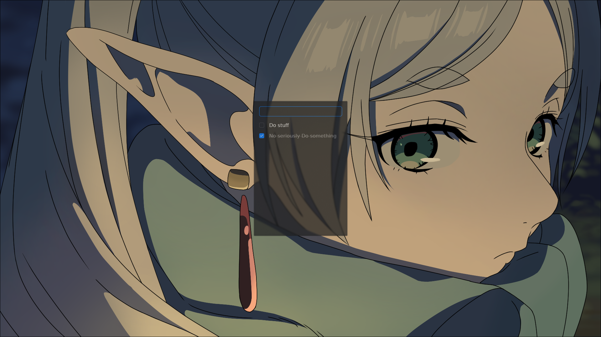

## gpui-todolist



A tiny, very chill todo app built with `gpui` (the Rust UI toolkit used by Zed).

This project is meant as a small, readable example of how to build a desktop UI with gpui — nothing fancy, just inputs, a list, and some state.

For the UI components, it uses [`gpui-component`](https://longbridge.github.io/gpui-component/), a small set of prebuilt pieces on top of gpui that make building interfaces a bit smoother. It's like the shadcn of gpui.

---

## What is gpui?

`gpui` is a Rust library for building native, GPU‑accelerated user interfaces.

Very roughly:

- You describe your UI as a tree of components.
- Components hold state and re-render when that state changes.
- Events (like clicks or key presses) trigger updates to that state.

You write normal Rust, and gpui handles:

- a window and render loop
- layout and drawing
- input events (mouse, keyboard, focus, etc.)

If you know React, SwiftUI, or other declarative UI frameworks, the mental model will feel familiar: _state in → UI out_.

---

## What this app does

This repo implements a simple todo list:

- Type into an input field.
- Press Enter (or click an add button, depending on the UI) to create a new item.
- See your items in a list.
- Toggle them as done / not done.

The goal is to show:

- how to wire gpui components together
- how to manage small bits of shared state
- how to structure a tiny gpui project

---

## Project structure

Top-level files:

- `Cargo.toml` – Rust crate metadata and dependencies.
- `shell.nix` – Optional Nix shell for getting a working Rust + system deps environment.
- `themes/` – A few JSON theme files (colors, etc.) that gpui can use.
- `src/` – All the Rust source code for the app.

Inside `src/`:

- `main.rs`

  - Entry point of the program.
  - Sets up gpui, opens a window, and mounts the main application UI.

- `window.rs`

  - Defines the main application window.
  - Usually wires together high-level layout and passes down shared state.

- `components/`

  - Reusable UI pieces that together form the todo app.

  - `components/mod.rs`

    - Re-exports the component modules so they can be imported more cleanly.

  - `components/input.rs`

    - The text input where you type new todos.
    - Handles key events (e.g. Enter) and notifies the app when a new item should be added.

  - `components/item.rs`

    - A single todo item row.
    - Knows how to display its text and whether it’s done.
    - Emits events when toggled or interacted with.

  - `components/list.rs`
    - The list of all todo items.
    - Renders a collection of `item` components based on the current app state.

The high-level data flow is:

`input` → creates new todo → stored in state → `list` renders items → `item` toggles/updates → state changes → UI re-renders.

---

## Running the app

You’ll need a recent Rust toolchain (`cargo`) and whatever system dependencies `gpui` requires on your platform (on Linux, that typically means a working GPU stack and common X11/Wayland dev libraries).

From the repo root:

```bash
cargo run
```

This should build the project and launch the gpui window with the todo list.

If you use Nix and want a pinned environment, you can try:

```bash
nix-shell
cargo run
```

---
